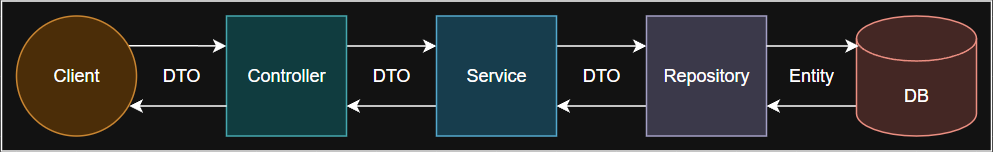
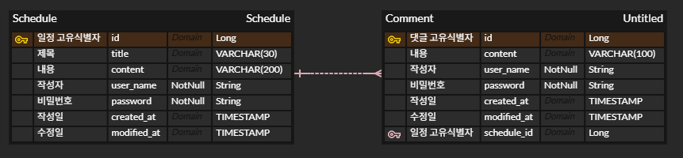

# 📅 일정 관리 앱 프로젝트
내일배움캠프에서 학습한 Spring 내용을 바탕으로 앱을 직접 만들어보는 프로젝트입니다.  
`3-Layer Architecture`, `JPA`, `Exception Handling`을 중심으로 구현하였습니다.

- - -

## 📌 학습 목표



- **3-Layer Architecture**에 따라 각 **Layer**의 목적에 맞게 개발하는 연습
- `JPA` + `MySQL`을 통해 CRUD (Create, Remove, Update, Delete) 기능을 개발
- `JPA Auditing`으로 작성일, 수정일 자동 처리
- 일정 수정/삭제 시 비밀번호 검증 로직 포함
- 예상 가능한 범위의 예외 처리

- - -

## 📋 필수 기능 가이드

- **Lv 0. API 명세 및 ERD 작성**
  <details>
  <summary>접기/펼치기</summary>

  - **API 명세서 작성하기**
    - API명세서는 프로젝트 root(최상위) 경로의 `README.md` 에 작성
  - **ERD 작성하기**
    - ERD는 프로젝트 root(최상위) 경로의 `README.md` 에 첨부
  </details>
- **Lv 1. 일정 생성** [#3](https://github.com/TwoTechSide/Sparta-Quest-Schedule-App/issues/3)
  <details>
  <summary>접기/펼치기</summary>

  - 일정 생성 시, 포함되어야할 데이터
    - `일정 제목`, `일정 내용`, `작성자명`, `비밀번호`, `작성/수정일`을 저장
    - `작성/수정일`은 날짜와 시간을 모두 포함한 형태
  - 각 일정의 고유 식별자(ID)를 자동으로 생성하여 관리
  - 최초 생성 시, `수정일`은 `작성일`과 동일
  - `작성일`, `수정일` 필드는 `JPA Auditing`을 활용하여 적용
  - API 응답에 `비밀번호`는 제외
  </details>
- **Lv 2. 일정 조회** [#6](https://github.com/TwoTechSide/Sparta-Quest-Schedule-App/issues/6)
  <details>
  <summary>접기/펼치기</summary>

  - **전체 일정 조회**
    - `작성자명`을 기준으로 등록된 일정 목록을 전부 조회
      - `작성자명`은 조회 조건으로 포함될 수도 있고, 포함되지 않을 수도 있습니다.
      - 하나의 API로 작성해야 합니다.
    - `수정일` 기준 내림차순으로 정렬
    - API 응답에 `비밀번호`는 제외해야 합니다.

  - **선택 일정 조회**
    - 선택한 일정 단건의 정보를 조회할 수 있습니다.
      - 일정의 고유 식별자(ID)를 사용하여 조회합니다.
    - API 응답에 `비밀번호`는 제외해야 합니다.
  </details>
- **Lv 3. 일정 수정** [#9](https://github.com/TwoTechSide/Sparta-Quest-Schedule-App/issues/9)
  <details>
  <summary>접기/펼치기</summary>

  - **선택한 일정 수정**
    - 선택한 일정 내용 중 `일정 제목`, `작성자명` 만 수정 가능
      - 서버에 일정 수정을 요청할 때 `비밀번호`를 함께 전달합니다.
      - `작성일` 은 변경할 수 없으며, `수정일` 은 수정 완료 시, 수정한 시점으로 변경되어야 합니다.
    - API 응답에 `비밀번호`는 제외해야 합니다.
  </details>
- **Lv 4. 일정 삭제** [#11](https://github.com/TwoTechSide/Sparta-Quest-Schedule-App/issues/11)
  <details>
  <summary>접기/펼치기</summary>

  - **선택한 일정 삭제**
    - 선택한 일정을 삭제할 수 있습니다.
      - 서버에 일정 삭제을 요청할 때 `비밀번호`를 함께 전달합니다.
  </details>

- - -

## 📚 도전 기능 가이드

- **Lv 5. 댓글 생성** [#15](https://github.com/TwoTechSide/Sparta-Quest-Schedule-App/issues/15)
  <details>
  <summary>접기/펼치기</summary>

  - **댓글 생성(댓글 작성하기)**
    - 일정에 댓글을 작성할 수 있습니다.
    - 댓글 생성 시, 포함되어야할 데이터
      - `댓글 내용`, `작성자명`, `비밀번호`, `작성/수정일`, `일정 고유식별자(ID)`를 저장
      - `작성/수정일`은 날짜와 시간을 모두 포함한 형태
    - 각 일정의 고유 식별자(ID)를 자동으로 생성하여 관리
    - 최초 생성 시, `수정일`은 `작성일`과 동일
    - `작성일`, `수정일` 필드는 `JPA Auditing`을 활용하여 적용합니다.
    - 하나의 일정에는 댓글을 10개까지만 작성할 수 있습니다.
    - API 응답에 `비밀번호`는 제외해야 합니다.
  </details>
- **Lv 6. 일정 단건 조회 업그레이드** [#17](https://github.com/TwoTechSide/Sparta-Quest-Schedule-App/issues/17)
  <details>
  <summary>접기/펼치기</summary>

  - **일정 단건 조회 업그레이드**
    - 일정 단건 조회 시, 해당 일정에 등록된 댓글들을 포함하여 함께 응답합니다.
    - API 응답에 `비밀번호`는 제외해야 합니다.
  </details>
- **Lv 7. 유저의 입력에 대한 검증 수행** [#19](https://github.com/TwoTechSide/Sparta-Quest-Schedule-App/issues/19)
  <details>
  <summary>접기/펼치기</summary>

  - 설명
    - 잘못된 입력이나 요청을 방지할 수 있습니다.
    - 데이터의 `무결성을 보장`하고 애플리케이션의 예측 가능성을 높여줍니다.
  - 조건
    - `일정 제목`은 최대 30자 이내로 제한, 필수값 처리
    - `일정 내용`은 최대 200자 이내로 제한, 필수값 처리
    - `댓글 내용`은 최대 100자 이내로 제한, 필수값 처리
    - `비밀번호`, `작성자명`은 필수값 처리
    - `비밀번호`가 일치하지 않을 경우 적절한 오류 코드 및 메세지를 반환해야 합니다.
  </details>

- - -

## 🛠 사용 기술 및 도구

- **Language**: Java 17
- **JDK** : Amazon Corretto 17
- **Framework** : Spring Boot 3.5.4
- **IDE** : IntelliJ IDEA
- **Version Control** : Git
- **Dependences** : Lombok, Spring Web, JPA

- - -

## 📁 디렉토리 구조

```
com.scheduleapp/
├── controller/                 # Controller 계층
│   ├── CommentController
│   └── ScheduleController
│
├── dto/
│   ├── comment/
│   ├── schedule/
│   └── ErrorResponseDto        # 예외 처리가 된 데이터 전송 객체 
│
├── entity/
├── exception/
├── repository/                 # Repository 계층
├── service/                    # Service 계층
└── SpartaSchedulerApplication  # 애플리케이션 시작 클래스
```

- - -

## 📄 ERD



- - -

## 📄 API 명세서

### - 일정 등록
<details>
<summary>접기/펼치기</summary>

  - 기본 정보
  
  |메서드|URL|설명|
  |---|---|---|
  |POST|`/schedules`|새로운 일정 추가|

  - 본문

  | 이름       |타입| 설명               |필수|
  |----------|---|------------------|---|
  | title    |String| 일정 제목 (길이 제한 : 30) |O|
  | content  |String| 일정 내용 (길이 제한 : 100) |O|
  | userName |String| 작성자명             |O|
  | password |String| 작성자 비밀번호         |O|

  - 응답 : CREATED

  | 이름         | 타입            | 설명       |
  |------------|---------------|----------|
  | id         | Long          | 일정 ID    |
  | title      | String        | 일정 제목    |
  | content    | String        | 일정 내용    |
  | userName   | String        | 작성자      |
  | createdAt  | LocalDateTime | 일정 생성 날짜 |
  | modifiedAt | LocalDateTime | 일정 수정 날짜 |

  ```json
  {
    "title" : "일정 제목",
    "content" : "일정 내용",
    "userName": "사용자명",
    "password": "패스워드"
  }
  ```
  
  ```json
  {
    "id" : 1,
    "title" : "일정 제목",
    "content" : "일정 내용",
    "userName" : "사용자명",
    "createdAt" : "2025-08-04T09:00:00.65383",
    "modifiedAt" : "2025-08-04T09:00:00.65383"
  }
  ```
  </details>

### - 일정 조회
  <details>
  <summary>접기/펼치기</summary>

  - 기본 정보

  | 메서드 | URL                    | 설명    |
  |-----|------------------------|-------|
  | GET | `/schedules?userName=''` | 일정 조회 |

  - 본문

  | 이름       |타입| 설명                                     | 필수 |
  |----------|---|----------------------------------------|----|
  | userName |String| 특정 작성자의 일정 조회<br>- 표기하지 않는 경우 모든 일정 조회 | X  |

  - 응답 : OK

  | 이름         | 타입            | 설명                                |
  |------------|---------------|-----------------------------------|
  |          | ScheduleResponseDto[]    | 일정 조회<br>- modifiedAt 내림차순 정렬로 반환 |

  ```json
  [
    {
      "id": 4,
      "title": "제목4",
      "content": "내용4",
      "userName": "작성자2",
      "createdAt": "2025-08-04T11:57:12.471575",
      "modifiedAt": "2025-08-04T11:57:12.471575"
    },
    {
      "id": 1,
      "title": "제목1",
      "content": "내용1",
      "userName": "작성자4",
      "createdAt": "2025-08-04T09:39:16.653843",
      "modifiedAt": "2025-08-04T10:00:10.541567"
    }
  ]
  ```
  </details>

  <details>
  <summary>접기/펼치기</summary>

  - 기본 정보

  | 메서드 | URL                       | 설명            |
  |-----|---------------------------|---------------|
  | GET | `/schedules/{scheduleId}` | 특정 아이디의 일정 조회 |

  - 응답 : OK

  | 이름         | 타입                  | 설명    |
  |------------|---------------------|-------|
  |          | ScheduleResponseDto | 일정 내용 |

  ```json
  {
    "id": 1,
    "title": "제목1",
    "content": "내용1",
    "userName": "작성자4",
    "createdAt": "2025-08-04T09:39:16.653843",
    "modifiedAt": "2025-08-04T10:00:10.541567"
  }
  ```
  </details>

### - 일정 수정
  <details>
  <summary>접기/펼치기</summary>

  - 기본 정보
  
  | 메서드   | URL                       | 설명    |
  |-------|---------------------------|-------|
  | PATCH | `/schedules/{scheduleId}` | 일정 수정 |
  
  - 본문
  
  | 이름       |타입| 설명               |필수|
  |----------|---|------------------|---|
  | title    |String| 일정 제목 (길이 제한 : 30) |O|
  | userName |String| 작성자명             |O|
  | password |String| 작성자 비밀번호         |O|
  
  - 응답 : OK
  
  | 이름         | 타입            | 설명       |
  |------------|---------------|----------|
  | id         | Long          | 일정 ID    |
  | title      | String        | 일정 제목    |
  | content    | String        | 일정 내용    |
  | userName   | String        | 작성자      |
  | createdAt  | LocalDateTime | 일정 생성 날짜 |
  | modifiedAt | LocalDateTime | 일정 수정 날짜 |

  ```json
  {
    "title" : "일정 제목",
    "userName": "사용자명",
    "password": "패스워드"
  }
  ```

  ```json
  {
    "id" : 1,
    "title" : "일정 제목",
    "content" : "일정 내용",
    "userName" : "사용자명",
    "createdAt" : "2025-08-04T09:00:00.65383",
    "modifiedAt" : "2025-08-04T09:00:00.65383"
  }
  ```
  </details>

### - 일정 삭제
  <details>
  <summary>접기/펼치기</summary>

  - 기본 정보

  | 메서드    | URL                       | 설명    |
  |--------|---------------------------|-------|
  | DELETE | `/schedules/{scheduleId}` | 일정 삭제 |

  - 응답 : NO_CONTENT
  </details>

### - 댓글 등록
  <details>
  <summary>접기/펼치기</summary>

  - 기본 정보
  
  | 메서드  | URL                                | 설명    |
  |------|------------------------------------|-------|
  | POST | `/schedules/{scheduleId}/comments` | 댓글 생성 |
  
  - 본문
  
  | 이름       |타입| 설명                  |필수|
  |----------|---|---------------------|---|
  | content  |String| 댓글 내용 (길이 제한 : 100) |O|
  | userName |String| 작성자명                |O|
  | password |String| 작성자 비밀번호            |O|
  
  - 응답 : CREATED
  
  | 이름         | 타입            | 설명       |
  |------------|---------------|----------|
  | content    | String        | 댓글 내용    |
  | userName   | String        | 작성자      |
  | createdAt  | LocalDateTime | 댓글 생성 날짜 |
  | modifiedAt | LocalDateTime | 댓글 수정 날짜 |

  ```json
  {
    "content" : "댓글",
    "userName": "사용자명",
    "password": "패스워드"
  }
  ```

  ```json
  {
    "content": "댓글",
    "userName": "2TS",
    "createdAt": "2025-08-04T09:00:00.0561175",
    "modifiedAt": "2025-08-04T09:00:00.0561175"
  }
  ```
  </details>

## 📅 개발 기간

-  25.07.29 ~ 25.08.04 (총 7일)
